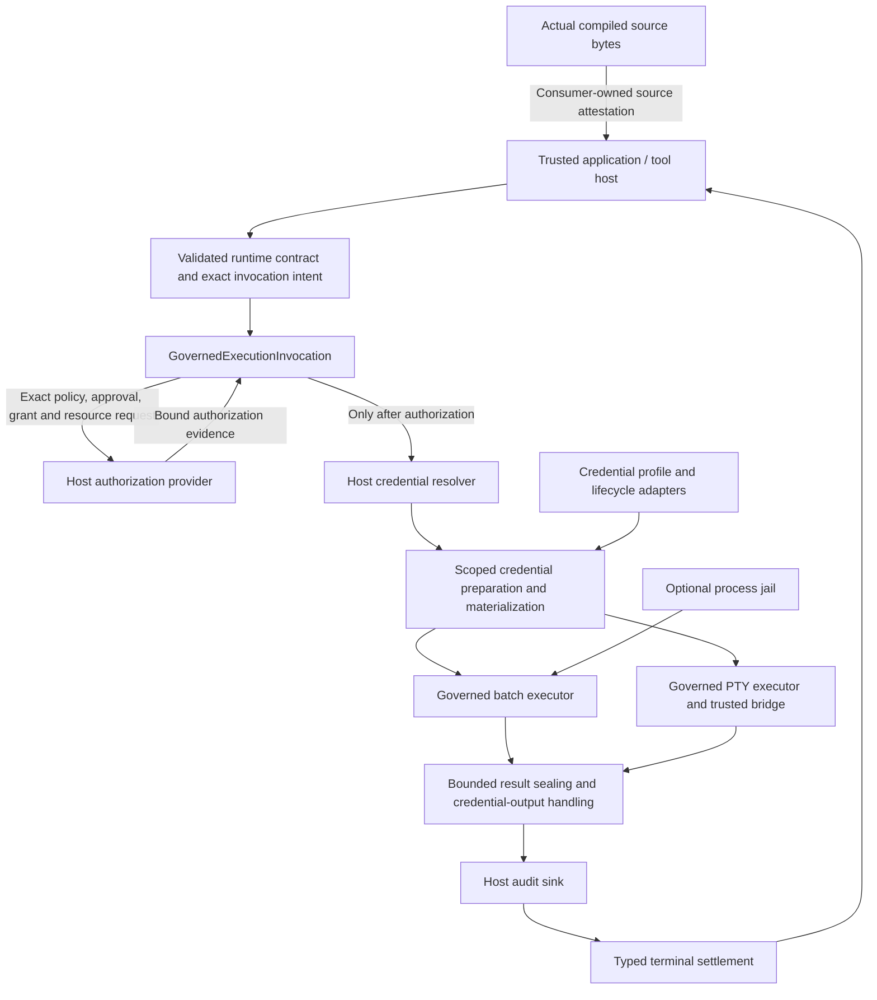

# MagicRun architecture

Architecture version: `0.1.73`

Original immutable baseline tag: `architecture/v0.1.73`. The current reviewed
source/document fingerprints are in [architecture-baseline.json](architecture-baseline.json).
Consumer documentation can evolve without changing runtime source or moving the
original tag; this document does not announce a new package release.

MagicRun is the `tool-runtime-core` Rust library for trusted execution hosts.
It is not a credential vault, a standalone agent daemon, or a generic
credential-reading tool. This versioned document describes the library boundary;
it does not announce a new package release or qualify a consumer integration.

## Components and authority flow



The application owns the agent/model boundary, authorization UI, credential
backend, executable provenance, working-directory policy, audit durability and
interactive bridge. MagicRun supplies execution primitives under those contracts.
Importing the crate does not isolate arbitrary same-user software or make an
untrusted host safe. The recipient process necessarily receives authorized
material, and a trusted PTY bridge must preserve the host's observation policy.

## Execution contract

1. Parse/validate the manifest and runtime contract; construct the execution
   intent, credential preparation plan and exact call context. Unsupported
   placements or inconsistent contracts fail before dispatch.
2. `GovernedExecutionInvocation` verifies policy/approval/grant/resource evidence
   for the exact invocation. The credential resolver is not called before
   authorization. Cancellation and deadline checks bound the admitted work.
3. Resolve only the selected credential material and prepare supported environment,
   stdin or explicitly authorized filesystem delivery. Filesystem placement needs
   its declared authority; no arbitrary existing credential file is adopted.
4. Activate executable authority and run batch execution, optional jail execution,
   or the governed PTY path. The host supplies the appropriate executor/bridge.
5. Bound and seal results, handle credential-bearing output through the declared
   contract, clean up scoped material, and settle terminal state through the
   host's metadata-only audit boundary. Preserve whether dispatch occurred;
   uncertainty is not a safe automatic-retry instruction.

Public entry points are `execute_batch`, `execute_batch_in_jail` and
`execute_pty` on `GovernedExecutionInvocation`. The library does not add a second
supervisor, launch an unrelated service, or silently replace a consumer's runtime.

## Module map

| Responsibility | Modules under `tool-runtime-core/src/` |
| --- | --- |
| Manifest admission and tool discovery | `manifest*`, `registry`, `inventory`, `tool_discovery`, MCP catalog policy/projection |
| Exact authorization and execution ownership | `governed_execution_coordinator`, `governed_execution_authority`, `governed_execution` |
| Batch, PTY, optional jail | `governed_batch_process`, `governed_pty_process`, `governed_process_jail` |
| Credential preparation and placement | `credential_preparation`, `credential_injection`, `credential_materialization`, `credential_filesystem` |
| Credential lifecycle and profiles | `credential_lifecycle*`, `credential_profiles`, `credential_profile_store`, `profile_selection` |
| Results and settlement | `governed_execution_result`, coordinator audit/terminal types |
| Portable host adapters | `browser_profile_adapter`, `native_permission_adapter`, `strategy_adapter`, `scoped_paths` |
| Source attestation input | `source_bytes` exposes the actual compiled source, never a frozen trusted digest |

## Invariants and integration limits

- **Authorization before credentials:** changing policy/approval ordering, exact
  request binding or the resolver boundary requires explicit architectural review.
- **Host responsibilities stay with the host:** custody/key identities, human
  approval, model-output projection, audit durability and runtime ownership are
  not supplied merely by linking the crate.
- **No new public surface by implication:** inventory/classification/replay helper
  binaries are development tools, not MagicVault's `secure_new_process` or an MCP
  secret-injection service. MagicVault's standalone 0.4.0 process adapter now
  invokes this existing public coordinator; MagicVault owns fixed destination
  profiles, human consent, custody, durable audit and receipt-only agent output.
  Its HTTP adapter is separate. No MagicRun runtime/API change is required.
- **Recipient access is real:** environment/stdin/files/PTY can contain material
  inside the authorized execution boundary. Document the actual output and
  bridge mediation contract; never claim universal credential invisibility.
- **No hidden retry or replacement owner:** preserve bounded deadlines,
  cancellation, dispatch evidence, cleanup and typed terminal settlement.
- **Consumer attestations track source:** `source_bytes` lets a consumer review
  actual compiled code. Documentation fingerprints below are not a replacement
  for that consumer-owned trust decision.

## Detecting architectural drift

### Synthetic process diagnostics

The custom compiler cfg `magicrun_test_diagnostics` enables a test-only observer
around the synchronous batch child's wait/cleanup/reap path. It is not a Cargo
feature, runtime flag, production log, callback or agent surface. Normal builds
omit its module and hooks; the standard release profile rejects the cfg.

A non-Send, non-cloneable capture must be opened and dropped on the invocation's
blocking thread. Nested capture is refused, at most 16 captures exist globally,
and unrelated threads/uncaptured work retain no observations. It keeps fixed
enums, booleans and saturating counts: owned-group check, wait event class,
closed signal category, cleanup attempts and final status. No PID, raw exit
code, command, path, environment, stream bytes or credential is retained or
printed. Signal diagnostics never select a process to terminate or alter the
existing cleanup decision. Observing a signal does not identify its sender.

This diagnostic does change the literal batch source bytes. Consumer-owned
source attestations must therefore change on a reviewed dependency upgrade;
they must never be frozen to preserve old approval. Magician's existing locked
dependency is not changed by this work. Default runtime behavior, production
API, credential contracts and schema remain unchanged. The optional diagnostic
source bytes are exposed only when the same cfg is enabled.

For a local synthetic investigation, use a separate target directory on the
build volume. Never package its output or point it at live credentials:

```bash
CARGO_TARGET_DIR=/Volumes/SSD1/magicrun/termination-diagnostic-builds \
RUSTFLAGS='--cfg magicrun_test_diagnostics' \
cargo test -p tool-runtime-core --lib process_test_diagnostics::

CARGO_TARGET_DIR=/Volumes/SSD1/magicrun/termination-diagnostic-builds \
RUSTFLAGS='--cfg magicrun_test_diagnostics' \
cargo test -p tool-runtime-core --lib \
  diagnostic_wait_and_reap_distinguish_normal_exit_from_recipient_signals
```

The second test uses actual owned normal/nonzero/SIGTERM/SIGKILL recipients.
Its observations distinguish pre-cleanup wait evidence from the reaped result.
They do not by themselves resolve an intermittent consumer failure. A consumer
must attach the capture to exactly its synthetic invocation and keep its own
fail-fast qualification evidence.

### Baseline review

[architecture-baseline.json](architecture-baseline.json) binds this document to
package `tool-runtime-core 0.1.73`, workspace/package manifests and production
`src/` fingerprints. The local, ignored Cargo lockfile is not a published
library architecture input. Dependency declarations still participate through
the manifest fingerprints.

`make check-architecture` fails on source additions/removals/edits, manifest
changes, document drift or a mismatched architecture version. `make check` and
the existing manual qualification workflow run the gate. `make test-architecture`
exercises the checker without compiling or running the library.

This is a deliberately coarse review signal, not a semantic diff or security
attestation. It can flag non-architectural source changes. Review the changed
boundaries, update the diagram/invariants/version when necessary, inspect the
candidate printed by `make -s architecture-snapshot`, and only then replace
the baseline and commit it with the reviewed source/doc changes. Never regenerate
fingerprints blindly to turn the gate green. Review the guard's discovery rules
when changing the top-level workspace layout.

[Build/test locations and commands](../README.md#build-and-test-location) remain
separate from runtime architecture. Source revisions, not a mutable “latest”
label, preserve prior architecture baselines in Git.
