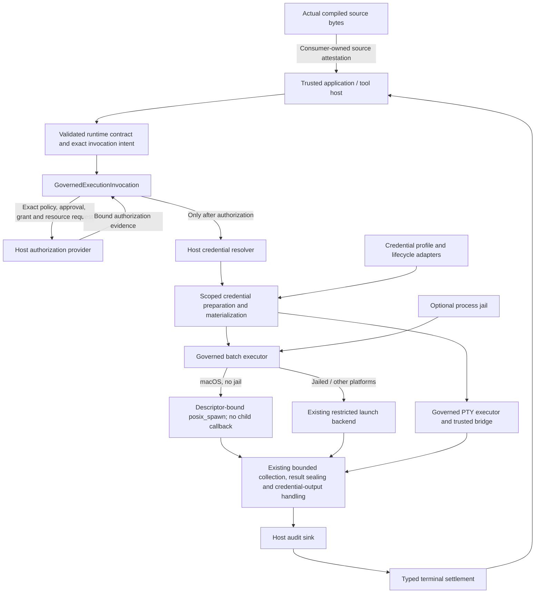
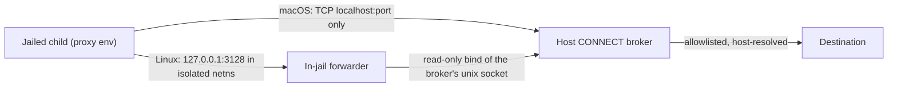

# MagicRun architecture

Architecture version: `0.1.76`

Original immutable baseline tag: `architecture/v0.1.73`. The current reviewed
source/document fingerprints are in [architecture-baseline.json](architecture-baseline.json).
Consumer documentation can evolve without changing runtime source or moving the
original tag; this document does not announce a new package release.

MagicRun is the `tool-runtime-core` Rust library for trusted execution hosts.
It is not a credential vault, a standalone agent daemon, or a generic
credential-reading tool. This versioned document describes the library boundary;
it does not announce a new package release or qualify a consumer integration.

## Components and authority flow



The application owns the agent/model boundary, authorization UI, credential
backend, executable provenance, working-directory policy, audit durability and
interactive bridge. MagicRun supplies execution primitives under those contracts.
Importing the crate does not isolate arbitrary same-user software or make an
untrusted host safe. The recipient process necessarily receives authorized
material, and a trusted PTY bridge must preserve the host's observation policy.

## Execution contract

1. Parse/validate the manifest and runtime contract; construct the execution
   intent, credential preparation plan and exact call context. Unsupported
   placements or inconsistent contracts fail before dispatch.
2. `GovernedExecutionInvocation` verifies policy/approval/grant/resource evidence
   for the exact invocation. The credential resolver is not called before
   authorization. Cancellation and deadline checks bound the admitted work.
3. Resolve only the selected credential material and prepare supported environment,
   stdin or explicitly authorized filesystem delivery. Filesystem placement needs
   its declared authority; no arbitrary existing credential file is adopted.
4. Activate executable authority and run batch execution, optional jail execution,
   or the governed PTY path. The host supplies the appropriate executor/bridge.
5. Bound and seal results, handle credential-bearing output through the declared
   contract, clean up scoped material, and settle terminal state through the
   host's metadata-only audit boundary. Preserve whether dispatch occurred;
   uncertainty is not a safe automatic-retry instruction.

Public entry points are `execute_batch`, `execute_batch_in_jail` and
`execute_pty` on `GovernedExecutionInvocation`. The library does not add a second
supervisor, launch an unrelated service, or silently replace a consumer's runtime.

## Module map

| Responsibility | Modules under `tool-runtime-core/src/` |
| --- | --- |
| Manifest admission and tool discovery | `manifest*`, `registry`, `inventory`, `tool_discovery`, MCP catalog policy/projection |
| Exact authorization and execution ownership | `governed_execution_coordinator`, `governed_execution_authority`, `governed_execution` |
| Batch, PTY, optional jail | `governed_batch_process` and its macOS spawn backend, `governed_pty_process`, `governed_process_jail` and its in-jail egress forwarder (`magicrun-jail-egress-forwarder`) |
| Credential preparation and placement | `credential_preparation`, `credential_injection`, `credential_materialization`, `credential_filesystem` |
| Credential lifecycle and profiles | `credential_lifecycle*`, `credential_profiles`, `credential_profile_store`, `profile_selection` |
| Results and settlement | `governed_execution_result`, coordinator audit/terminal types |
| Portable host adapters | `browser_profile_adapter`, `native_permission_adapter`, `strategy_adapter`, `scoped_paths` |
| Source attestation input | `source_bytes` exposes the actual compiled source, never a frozen trusted digest |

## Invariants and integration limits

- **Authorization before credentials:** changing policy/approval ordering, exact
  request binding or the resolver boundary requires explicit architectural review.
- **Host responsibilities stay with the host:** custody/key identities, human
  approval, model-output projection, audit durability and runtime ownership are
  not supplied merely by linking the crate.
- **No new public surface by implication:** inventory/classification/replay helper
  binaries are development tools, not MagicVault's `secure_new_process` or an MCP
  secret-injection service. MagicVault's standalone 0.4.0 process adapter now
  invokes this existing public coordinator; MagicVault owns fixed destination
  profiles, human consent, custody, durable audit and receipt-only agent output.
  Its HTTP adapter is separate. The later `0.1.74` non-jailed macOS launch
  correction changes runtime implementation, not these public entry points.
- **Recipient access is real:** environment/stdin/files/PTY can contain material
  inside the authorized execution boundary. Document the actual output and
  bridge mediation contract; never claim universal credential invisibility.
- **No hidden retry or replacement owner:** preserve bounded deadlines,
  cancellation, dispatch evidence, cleanup and typed terminal settlement.
- **Consumer attestations track source:** `source_bytes` lets a consumer review
  actual compiled code. Documentation fingerprints below are not a replacement
  for that consumer-owned trust decision.
- **Declared artifacts fail closed off Unix:** the descriptor-relative artifact
  collector is compiled only where its Unix identity and `openat` checks exist.
  Windows builds retain the public contract but reject artifact authority until
  an equivalent handle-relative implementation is reviewed.

## Brokered-egress process jail

`0.1.76` adds `GovernedProcessJail::strict_app_with_brokered_egress`, an
explicitly opted-in variant of the strict jail whose only reachable network is
one host-owned HTTP CONNECT broker. `strict_app` and its profile, argv and
audit are unchanged (pinned by golden tests). The host owns the broker and all
egress policy — destination allowlist, name resolution, private-address
refusal, byte metering; the jail only guarantees there is no other way out.



- **macOS** (`LoopbackTcp { port }`): the strict SBPL profile plus
  `network-outbound` IPv4 TCP to `localhost:<port>` (`remote tcp4`) and read-only `/private/etc/ssl`.
  No `mach-lookup` (so no mDNSResponder DNS and no trustd), no bind/inbound.
  TLS stacks that need trustd (Security.framework, Go on macOS) cannot verify
  certificates here; file-based stores (`SSL_CERT_FILE`, OpenSSL/LibreSSL,
  rustls with bundled roots, certifi) work.
- **Linux** (`UnixSocket { path }`): `--unshare-all` stays, so the jail has
  its own netns with only `lo` and no resolver files. A host TCP proxy is
  unreachable from there, so `magicrun-jail-egress-forwarder` — installed
  root-owned at a fixed path, validated like `bwrap`, digested into the audit —
  runs first inside the jail, listens on `127.0.0.1:3128`, starts the exact
  executable as its only child and relays each connection to the broker
  socket (bind-mounted read-only; `connect(2)` does not need a writable
  mount). It is single-threaded, never writes to stdio, never resolves names,
  and exits with the child's exact status. It adds no authority: the child
  could connect to the same socket directly.
- The child environment is overlaid last with the proxy variables (upper and
  lower case), empty `NO_PROXY`, and `SSL_CERT_FILE` for an exposed host trust
  bundle. A child that ignores them has nothing to connect to.
- Identity: a brokered jail reports schema
  `tool-runtime.governed-process-jail.brokered-egress.v1`;
  `governed_process_jail_profile_identity(platform, network)` digests the
  rendered profile/argv template and overlay without needing a jail, for lock
  digests; `GovernedProcessJailAudit::egress` carries the concrete binding
  (broker kind and port, forwarder digest, binding identity). The strict audit
  omits the field and serializes byte-for-byte as before.
- Secrets need no new surface: a reviewed `auth.injections` secret with an
  environment target already reaches a jailed child through
  `CredentialPreparationPlan` and the host's `CredentialMaterialResolver`.

## Declared login prompts

`0.1.75` lets a skill's `auth.lifecycle.login_prompts` name the prompts its
login hook may print on the PTY — each a `kind` (`username`, `password`,
`otp`, `device_code`, `operator`) and the literal `marker` the prompt line
ends with. `manifest::declared_login_prompt` matches only the line the cursor
is on, after dropping ANSI escapes, and only when it ends with a declared
marker: arbitrary terminal text is never a prompt, and a marker mentioned
elsewhere in the output is not one either. The host's interaction bridge
decides what a match means — answer it through the host's own secure channel
(`CredentialLifecycleInteractionAction::ProvideInput`, the value never enters
coordinator state) or settle the operation as an `authentication_required`
challenge typed by the kind. `CredentialLifecyclePendingKind::Password` names
that class beside the existing `Otp`. Empty `login_prompts` keeps today's
behaviour. No runtime source outside the manifest and the pending-kind enum
changes; no process, credential or wire contract moves.

## macOS non-jailed batch launch

`0.1.74` uses native `posix_spawn` for non-jailed macOS batch commands. The
previous unconditional `pre_exec` callback forced Rust onto its fork path.
Apple [recommends combined spawning for framework-using processes](https://developer.apple.com/forums/thread/737464);
its [syscall wrapper and fchdir action](https://github.com/apple-oss-distributions/xnu/blob/f6217f891ac0bb64f3d375211650a4c1ff8ca1ea/libsyscall/wrappers/spawn/posix_spawn.c)
avoid executing the parent's userspace fork/at-fork code in a child. This
eliminates that launch interval, not all possible recipient or OS failures.

The private adapter accepts original authorized argv/environment bytes and the
absolute executable snapshot. It validates NUL/name ambiguity before copying
into zeroizing C buffers; no `Command` getter round-trip, PATH search, shell
fallback or ambient environment is used. The runner revalidates authority and
checks cancellation/deadline after preparing resources and before dispatch.

An independently owned duplicate of the authorized cwd descriptor feeds
`posix_spawn_file_actions_addfchdir_np`; no path is re-resolved, including after a
directory rename/replacement. The function is resolved dynamically: macOS below
10.15 refuses this operation, never silently reverting to fork. Stdio sources
are normalized above descriptors 0–2, duplicated into stdio and explicitly
closed. `POSIX_SPAWN_CLOEXEC_DEFAULT` excludes other descriptors. The inherited
signal mask and ordinary SIGPIPE reset match the previous runner contract; a
new process group is established at spawn. No parent cwd/environment changes.

The existing bounded readers/writer, wait-before-cleanup collector, cancellation,
deadlines and footprint watchdog own execution afterward. A native child caches
its reaped status, retries interrupted waits only, and never signals a reaped
identity. An unwinding owner kills/reaps its still-owned group. Darwin spawn
errors return no child; no uncertain operation is retried. Native launch is not
used for jail requests: their pre-exec resource limits are not available through
this backend and must not be silently dropped. PTY and non-macOS paths retain
their existing behavior and are not newly qualified as fork-free.

Tests cover real cwd replacement, exact argv/env/stdin, malformed input, closed
stdio, deliberate non-CLOEXEC descriptor isolation, spawn errors and cached reap.
A dedicated helper registers a fork handler: native launch must not invoke it,
while a subsequent explicit fork-path positive control must. The exact consumer
process/HTTP concurrency remains the qualification scenario, without retries or
longer deadlines. No claim of universal absence of future failures is implied.

The existing macOS `GOVERNED_BATCH_PROCESS` attestation bytes now bundle the
actual new backend text as well as the outer runner, so existing consumers do
not accidentally omit delegated execution code. Its fingerprint and the cwd
authority fingerprint change; a consumer must review those changes on upgrade.
Magician's source/dependency remains unchanged until its owner chooses to upgrade.

## Detecting architectural drift

### Synthetic process diagnostics

The custom compiler cfg `magicrun_test_diagnostics` enables a test-only observer
around the synchronous batch child's wait/cleanup/reap path. It is not a Cargo
feature, runtime flag, production log, callback or agent surface. Normal builds
omit its module and hooks; the standard release profile rejects the cfg.

A non-Send, non-cloneable capture must be opened and dropped on the invocation's
blocking thread. Nested capture is refused, at most 16 captures exist globally,
and unrelated threads/uncaptured work retain no observations. It keeps fixed
enums, booleans and saturating counts: owned-group check, wait event class,
closed signal category, cleanup attempts and final status. No PID, raw exit
code, command, path, environment, stream bytes or credential is retained or
printed. Signal diagnostics never select a process to terminate or alter the
existing cleanup decision. Observing a signal does not identify its sender.

For an owned signal-terminated child, the macOS observer makes at most one
`proc_pidinfo(PROC_PIDEXITREASONBASICINFO)` call per capture, immediately after
`waitid(WNOWAIT)` and before cleanup/reap. This private flavor supports zombie
lookup and restricts access to the parent/parent debugger. Its fixed packed
24-byte record is decoded into closed namespace/code categories; flags and
payload length are discarded and the payload itself is never requested.
Unsupported, denied, missing-reason/process and malformed-size results remain
explicit observations, not execution errors or retry instructions. Other
platforms record unsupported; ordinary exits and uncaptured work never query.
No PID, raw namespace/code, payload or growing history is stored. The query
does not modify waits, timeouts, cleanup, signals or the execution result.

The ABI and categories follow Apple's XNU
[`proc_info` implementation](https://github.com/apple-oss-distributions/xnu/blob/f6217f891ac0bb64f3d375211650a4c1ff8ca1ea/bsd/kern/proc_info.c),
[`proc_info.h`](https://github.com/apple-oss-distributions/xnu/blob/f6217f891ac0bb64f3d375211650a4c1ff8ca1ea/bsd/sys/proc_info.h),
[`private flavor`](https://github.com/apple-oss-distributions/xnu/blob/f6217f891ac0bb64f3d375211650a4c1ff8ca1ea/bsd/sys/proc_info_private.h)
and [`reason.h`](https://github.com/apple-oss-distributions/xnu/blob/f6217f891ac0bb64f3d375211650a4c1ff8ca1ea/bsd/sys/reason.h).
This is diagnostic evidence, not a stable production API or proof of a signal's
sender. Unknown codes remain closed `Other` categories and require review.
Every namespace defined in that reviewed header has a named category (including
`INVALID`); unknown namespace values remain `OtherNamespace`. A catch-all result
from an older decoder cannot be retrospectively assigned one of the new names.

For the retained standard-command path on macOS, an active capture prepares one anonymous `MAP_SHARED`
mapping containing a lock-free atomic byte before spawn. Only the parent
allocates/clones its owning Arc. The child's existing pre-exec callback performs
two atomic stores: at entry and immediately before successful return. It never
uses TLS, locks, allocation, logging or extra descriptors. The parent reads a
closed stage after spawn returns, including an error return; allocation failure
is `Unavailable`, never an execution decision. Uncaptured work allocates nothing.
The mapping is retained through the Command's callback lifetime and unmapped by
its final parent owner; exec/exit discards the child mapping. Capture capacity
also bounds simultaneous observed invocations. Other platforms leave this stage
absent. No event history, address or arbitrary byte is exposed.

`CallbackNotEntered`, `CallbackEntered` and `CallbackCompleted` localize the
callback boundary, **not** the exception site or recipient entry. Completed does
not prove exec succeeded, and a returned child handle alone is not proof of exec:
Rust 1.92's [Unix spawn implementation](https://github.com/rust-lang/rust/blob/1.92.0/library/std/src/sys/process/unix/unix.rs)
treats EOF on the child error pipe as a successful spawn, including child death
before exec. Its registered callback forces the fork path; no new callback is
added solely to select a different launch mechanism. Native `posix_spawn` instead
records `SpawnMethod::MacosPosixSpawn` with no pre-exec stage; it allocates no
callback probe and must never report `CallbackCompleted`. The probe follows
[`pre_exec`'s safety boundary](https://doc.rust-lang.org/std/os/unix/process/trait.CommandExt.html#tymethod.pre_exec)
and [shared mmap inheritance](https://pubs.opengroup.org/onlinepubs/9799919799/functions/mmap.html).
Synthetic children cover death before/inside/after the callback, callback error,
successful exec and failed exec after callback completion. The original process
and HTTP concurrency, deadlines, cleanup and uncertainty rules are unchanged.

This diagnostic does change the literal batch source bytes. Consumer-owned
source attestations must therefore change on a reviewed dependency upgrade;
they must never be frozen to preserve old approval. Magician's existing locked
dependency is not changed by this work. Enabling the observer does not change
runtime decisions, production API, credential contracts or schema. The optional diagnostic
source bytes are exposed only when the same cfg is enabled.

For a local synthetic investigation, use a separate target directory on the
build volume. Never package its output or point it at live credentials:

```bash
CARGO_TARGET_DIR=/Volumes/SSD1/magicrun/termination-diagnostic-builds \
RUSTFLAGS='--cfg magicrun_test_diagnostics' \
cargo test -p tool-runtime-core --lib process_test_diagnostics::

CARGO_TARGET_DIR=/Volumes/SSD1/magicrun/termination-diagnostic-builds \
RUSTFLAGS='--cfg magicrun_test_diagnostics' \
cargo test -p tool-runtime-core --lib \
  diagnostic_wait_and_reap_distinguish_normal_exit_from_recipient_signals
```

The second test uses actual owned normal/nonzero/SIGTERM/SIGKILL recipients.
Its observations distinguish pre-cleanup wait evidence from the reaped result.
They do not by themselves resolve an intermittent consumer failure. A consumer
must attach the capture to exactly its synthetic invocation and keep its own
fail-fast qualification evidence.

### Baseline review

[architecture-baseline.json](architecture-baseline.json) binds this document to
package `tool-runtime-core 0.1.74`, workspace/package manifests and production
`src/` fingerprints. The local, ignored Cargo lockfile is not a published
library architecture input. Dependency declarations still participate through
the manifest fingerprints.

`make check-architecture` fails on source additions/removals/edits, manifest
changes, document drift or a mismatched architecture version. `make check` and
the existing manual qualification workflow run the gate. `make test-architecture`
exercises the checker without compiling or running the library.

This is a deliberately coarse review signal, not a semantic diff or security
attestation. It can flag non-architectural source changes. Review the changed
boundaries, update the diagram/invariants/version when necessary, inspect the
candidate printed by `make -s architecture-snapshot`, and only then replace
the baseline and commit it with the reviewed source/doc changes. Never regenerate
fingerprints blindly to turn the gate green. Review the guard's discovery rules
when changing the top-level workspace layout.

[Build/test locations and commands](../README.md#build-and-test-location) remain
separate from runtime architecture. Source revisions, not a mutable “latest”
label, preserve prior architecture baselines in Git.
