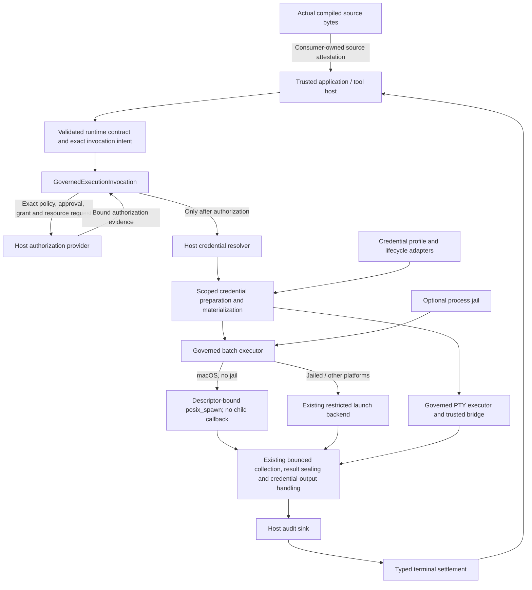
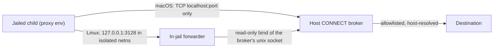
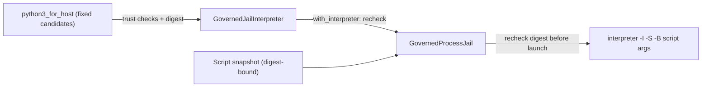
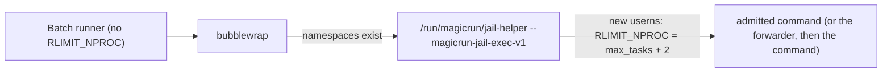
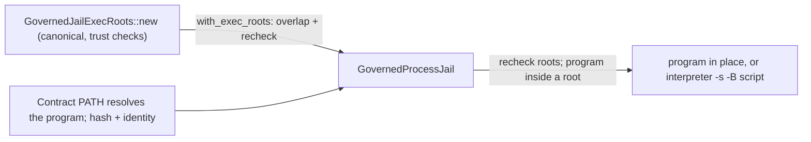

# MagicRun architecture

Architecture version: `0.1.81`

Original immutable baseline tag: `architecture/v0.1.73`. The current reviewed
source/document fingerprints are in [architecture-baseline.json](architecture-baseline.json).
Consumer documentation can evolve without changing runtime source or moving the
original tag; this document does not announce a new package release.

MagicRun is the `tool-runtime-core` Rust library for trusted execution hosts.
It is not a credential vault, a standalone agent daemon, or a generic
credential-reading tool. This versioned document describes the library boundary;
it does not announce a new package release or qualify a consumer integration.

## Components and authority flow


```mermaid
flowchart TB
    host["Trusted application / tool host"] --> contract["Validated runtime contract and exact invocation intent"]
    contract --> coordinator["GovernedExecutionInvocation"]
    coordinator -->|"Exact policy, approval, grant and resource request"| authorizer["Host authorization provider"]
    authorizer -->|"Bound authorization evidence"| coordinator
    coordinator -->|"Only after authorization"| resolver["Host credential resolver"]
    resolver --> material["Scoped credential preparation and materialization"]
    material --> batch["Governed batch executor"]
    material --> pty["Governed PTY executor and trusted bridge"]
    jail["Optional process jail"] --> batch
    batch -->|"macOS, no jail"| spawn["Descriptor-bound posix_spawn; no child callback"]
    batch -->|"Jailed / other platforms"| standard["Existing restricted launch backend"]
    spawn --> result["Existing bounded collection, result sealing and credential-output handling"]
    standard --> result
    pty --> result
    result --> audit["Host audit sink"]
    audit --> settlement["Typed terminal settlement"]
    settlement --> host
    profiles["Credential profile and lifecycle adapters"] --> material
    source["Actual compiled source bytes"] -->|"Consumer-owned source attestation"| host
```

The application owns the agent/model boundary, authorization UI, credential
backend, executable provenance, working-directory policy, audit durability and
interactive bridge. MagicRun supplies execution primitives under those contracts.
Importing the crate does not isolate arbitrary same-user software or make an
untrusted host safe. The recipient process necessarily receives authorized
material, and a trusted PTY bridge must preserve the host's observation policy.

## Execution contract

1. Parse/validate the manifest and runtime contract; construct the execution
   intent, credential preparation plan and exact call context. Unsupported
   placements or inconsistent contracts fail before dispatch.
2. `GovernedExecutionInvocation` verifies policy/approval/grant/resource evidence
   for the exact invocation. The credential resolver is not called before
   authorization. Cancellation and deadline checks bound the admitted work.
3. Resolve only the selected credential material and prepare supported environment,
   stdin or explicitly authorized filesystem delivery. Filesystem placement needs
   its declared authority; no arbitrary existing credential file is adopted.
4. Activate executable authority and run batch execution, optional jail execution,
   or the governed PTY path. The host supplies the appropriate executor/bridge.
5. Bound and seal results, handle credential-bearing output through the declared
   contract, clean up scoped material, and settle terminal state through the
   host's metadata-only audit boundary. Preserve whether dispatch occurred;
   uncertainty is not a safe automatic-retry instruction.

Public entry points are `execute_batch`, `execute_batch_in_jail` and
`execute_pty` on `GovernedExecutionInvocation`. The library does not add a second
supervisor, launch an unrelated service, or silently replace a consumer's runtime.

## Module map

| Responsibility | Modules under `tool-runtime-core/src/` |
| --- | --- |
| Manifest admission and tool discovery | `manifest*`, `registry`, `inventory`, `tool_discovery`, MCP catalog policy/projection |
| Exact authorization and execution ownership | `governed_execution_coordinator`, `governed_execution_authority`, `governed_execution` |
| Batch, PTY, optional jail | `governed_batch_process` and its macOS spawn backend, `governed_pty_process`, `governed_process_jail` and its in-jail helper (`magicrun-jail-egress-forwarder`: the Linux exec shim and the egress forwarder) |
| Credential preparation and placement | `credential_preparation`, `credential_injection`, `credential_materialization`, `credential_filesystem` |
| Credential lifecycle and profiles | `credential_lifecycle*`, `credential_profiles`, `credential_profile_store`, `profile_selection` |
| Results and settlement | `governed_execution_result`, coordinator audit/terminal types |
| Portable host adapters | `browser_profile_adapter`, `native_permission_adapter`, `strategy_adapter`, `scoped_paths` |
| Source attestation input | `source_bytes` exposes the actual compiled source, never a frozen trusted digest |

## Invariants and integration limits

- **Authorization before credentials:** changing policy/approval ordering, exact
  request binding or the resolver boundary requires explicit architectural review.
- **Host responsibilities stay with the host:** custody/key identities, human
  approval, model-output projection, audit durability and runtime ownership are
  not supplied merely by linking the crate.
- **No new public surface by implication:** inventory/classification/replay helper
  binaries are development tools, not MagicVault's `secure_new_process` or an MCP
  secret-injection service. MagicVault's standalone 0.4.0 process adapter now
  invokes this existing public coordinator; MagicVault owns fixed destination
  profiles, human consent, custody, durable audit and receipt-only agent output.
  Its HTTP adapter is separate. The later `0.1.74` non-jailed macOS launch
  correction changes runtime implementation, not these public entry points.
- **Recipient access is real:** environment/stdin/files/PTY can contain material
  inside the authorized execution boundary. Document the actual output and
  bridge mediation contract; never claim universal credential invisibility.
- **No hidden retry or replacement owner:** preserve bounded deadlines,
  cancellation, dispatch evidence, cleanup and typed terminal settlement.
- **Consumer attestations track source:** `source_bytes` lets a consumer review
  actual compiled code. Documentation fingerprints below are not a replacement
  for that consumer-owned trust decision.
- **Declared artifacts fail closed off Unix:** the descriptor-relative artifact
  collector is compiled only where its Unix identity and `openat` checks exist.
  Windows builds retain the public contract but reject artifact authority until
  an equivalent handle-relative implementation is reviewed.

## Brokered-egress process jail

`0.1.76` adds `GovernedProcessJail::strict_app_with_brokered_egress`, an
explicitly opted-in variant of the strict jail whose only reachable network is
one host-owned HTTP CONNECT broker. `strict_app` and its profile, argv and
audit are unchanged (pinned by golden tests). The host owns the broker and all
egress policy — destination allowlist, name resolution, private-address
refusal, byte metering; the jail only guarantees there is no other way out.


```mermaid
flowchart LR
    child["Jailed child (proxy env)"] -->|"macOS: TCP localhost:port only"| broker["Host CONNECT broker"]
    child -->|"Linux: 127.0.0.1:3128 in isolated netns"| fwd["In-jail forwarder"]
    fwd -->|"read-only bind of the broker's unix socket"| broker
    broker -->|"allowlisted, host-resolved"| internet["Destination"]
```

- **macOS** (`LoopbackTcp { port }`): the strict SBPL profile plus
  `network-outbound` IPv4 TCP to `localhost:<port>` (`remote tcp4`) and read-only `/private/etc/ssl`.
  No `mach-lookup` (so no mDNSResponder DNS and no trustd), no bind/inbound.
  TLS stacks that need trustd (Security.framework, Go on macOS) cannot verify
  certificates here; file-based stores (`SSL_CERT_FILE`, OpenSSL/LibreSSL,
  rustls with bundled roots, certifi) work.
- **Linux** (`UnixSocket { path }`): `--unshare-all` stays, so the jail has
  its own netns with only `lo` and no resolver files. A host TCP proxy is
  unreachable from there, so `magicrun-jail-egress-forwarder` — installed
  root-owned at a fixed path, validated like `bwrap`, digested into the audit —
  runs first inside the jail, listens on `127.0.0.1:3128`, starts the exact
  executable as its only child and relays each connection to the broker
  socket (bind-mounted read-only; `connect(2)` does not need a writable
  mount). It is single-threaded, never writes to stdio, never resolves names,
  and exits with the child's exact status. It adds no authority: the child
  could connect to the same socket directly.
- The child environment is overlaid last with the proxy variables (upper and
  lower case), empty `NO_PROXY`, and `SSL_CERT_FILE` for an exposed host trust
  bundle. A child that ignores them has nothing to connect to.
- Identity: a brokered jail reports schema
  `tool-runtime.governed-process-jail.brokered-egress.v1`;
  `governed_process_jail_profile_identity(platform, network)` digests the
  rendered profile/argv template and overlay without needing a jail, for lock
  digests; `GovernedProcessJailAudit::egress` carries the concrete binding
  (broker kind and port, forwarder digest, binding identity). The strict audit
  omits the field and serializes byte-for-byte as before.
- Secrets need no new surface: a reviewed `auth.injections` secret with an
  environment target already reaches a jailed child through
  `CredentialPreparationPlan` and the host's `CredentialMaterialResolver`.

## Interpreter mode

`0.1.77` adds `GovernedProcessJail::with_interpreter`, an opt-in that lets the
strict or brokered jail run a reviewed script under a pinned interpreter
without widening the jail for anything else. The governed pipeline is
unchanged: the script is resolved through the contract's `PATH`, hashed
(`with_expected_executable_digest` binds the script bytes) and privately
snapshotted as today. Only the jail's command template changes, inside
`GovernedProcessJail::command`; the batch runner still calls
`jail.command(&executable)` and appends the admitted arguments.


```mermaid
flowchart LR
    discovery["python3_for_host (fixed candidates)"] -->|"trust checks + digest"| interpreter["GovernedJailInterpreter"]
    interpreter -->|"with_interpreter: recheck"| jail["GovernedProcessJail"]
    snapshot["Script snapshot (digest-bound)"] --> jail
    jail -->|"recheck digest before launch"| argv["interpreter -I -S -B script args"]
```

- **Pinned interpreter.** `GovernedJailInterpreter` has no caller-path
  constructor; `python3_for_host()` walks fixed candidates. The candidate
  spelling must be root-owned end to end, its canonical `python3.N` binary
  must pass the trusted-launcher checks, and the derived executable, pinned
  images and library roots must too (library trees are walked entry by entry).
  Its digest is a domain-separated BLAKE3 over the executable and images. It
  is rechecked when a jail takes it and immediately before every launch. Only
  root can change root-owned bytes in non-writable directories between that
  recheck and exec.
- **macOS.** Candidates in order: python.org, then CommandLineTools
  `…/Versions/Current/bin/python3`. Xcode.app is not a candidate:
  `/Applications` is `root:admin` 0775 on stock macOS, so it can never pass.
  The jail execs the framework's `Resources/Python.app/Contents/MacOS/Python`
  directly (the `bin` binary is a stub that would re-exec it) and pins the
  framework library. The profile is the strict profile rendered with the
  interpreter as the sole `process-exec` literal, plus a read-only literal of
  the script snapshot, read-only literals of the pinned images, a read-only
  `Versions/X.Y/lib` subpath and a final deny of `lib/pythonX.Y/site-packages`.
  That is exactly what `import json, urllib.request, ssl, xml.etree.ElementTree`
  needs under `-I -S -B`; it needs no ancestor metadata. `process-fork` stays
  denied and the script is never exec-allowed. `/usr/bin/python3` is an `xcrun`
  shim and is never used. The python.org installer leaves its framework
  `root:admin` 0775 (on the development host admin users had written into it),
  so it fails the trust check until it is made root-owned and
  `chmod -R go-w`; the CommandLineTools framework (`root:wheel` 0755) passes.
- **Linux.** Canonical `/usr/bin/python3` (`python3.N`). Candidate stdlib
  roots `/usr/lib/python3.N` and `/usr/lib64/python3.N` are canonicalized and
  deduplicated (Arch links `lib64` to `lib`). A shared-libpython build
  (Fedora, RHEL, Arch) keeps the interpreter in `libpython3.N.so.*`: its
  `DT_NEEDED` entry is read from the executable's ELF64 dynamic section and
  the library, found as a regular file in the canonical `/usr/lib64`,
  `/usr/lib/<multiarch>` or `/usr/lib`, is pinned as an image; a needed
  libpython that is missing, a symlink or of another version refuses. The
  interpreter, images and roots are read-only bound at their own paths; argv
  becomes `<interpreter> -I -S -B /app/<script>`, under the forwarder when
  brokered. Bubblewrap has no exec control (`/work` is not `noexec` and there
  is no seccomp filter), so the audit reports `script_exec_denied: false`
  there, and `site-packages` is off `sys.path` (`-S`) but readable
  (`site_packages_read_denied: false`). This path is compile-checked only.
- **No native code from the workdir (both modes, macOS).** The workdir is the
  only writable subtree, and `0.1.77` adds
  `(deny file-map-executable (subpath "<workdir>"))` to the strict profile, so
  files written there cannot be `dlopen`ed (including via `ctypes.CDLL`) or
  mapped `PROT_EXEC`, and cannot be injected by `DYLD_INSERT_LIBRARIES` on a
  re-exec (dyld then refuses to start). It does not stop native code created
  in memory: mapping a file read-only and then `mprotect`ing it executable,
  or `ctypes` over anonymous memory, still works, inside the same profile.
  Tools that unpack a shared library into `TMPDIR` and load it (some JNA,
  sqlite-jdbc, .NET single-file and packaged Node addons) no longer work in
  the jail. This deliberately changes the strict profile and rotates the macOS
  strict and brokered identities. The jail also strips `DYLD_*` and
  `__PYVENV_LAUNCHER__` from the child environment; manifest validation
  already refuses `DYLD_*`.
- **Identity.** `profile_identity()` in interpreter mode equals
  `governed_process_jail_interpreter_profile_identity(platform, network, kind,
  version)`: the placeholder-rendered template plus interpreter kind,
  `major.minor` and flags, with no host path. It binds `major.minor` only, on
  purpose: a patch update of the pinned interpreter changes the audited
  digest, not the lock identity. `GovernedProcessJailAudit::interpreter`
  records kind, version and digest. `launch_flags` and
  `launch_user_site_disabled` are launch hygiene; `script_exec_denied` and
  `site_packages_read_denied` are profile guarantees and are `false` where the
  platform cannot enforce them. Golden tests pin every profile, argv and
  identity.
- **Limits.** The flags are hygiene; the sandbox is the boundary. A script
  can re-exec the interpreter literal without `-I -S -B` (a test shows the
  re-exec still cannot read the host home or `~/.ssh`), `exec()` Python it
  builds, or run native code it creates in memory (`ctypes`, or a file mapped
  read-only and then `mprotect`ed executable). It cannot `dlopen` or
  `PROT_EXEC`-map files it writes (macOS). All of it stays inside the same
  profile. Single-file stdlib-only scripts are the supported
  shape: `-I` puts neither the script directory nor the cwd on `sys.path`.
  Trust checks read ownership and mode bits only; ACLs are not inspected
  (as for the trusted launcher).

### Also in `0.1.77`

- **macOS process watchdog.** It sized its process-group query with a null
  buffer, which XNU answers with a system-wide estimate, so every jailed
  child that lived long enough to be sampled ended as `ProcessLimitExceeded`.
  It now queries into a fixed buffer larger than the ceiling; a full buffer
  is a breach.
- **Linux egress forwarder.** A broker or client that hangs up is marked gone
  once and leaves the poll set when nothing is left to read from it, so a
  broker hang-up with a reply still buffered for a slow client no longer
  spins until `RLIMIT_CPU`. Accept failures such as `EMFILE` pause the
  listener for 250 ms or until a relay closes. Broker connects are
  non-blocking (a full backlog closes that client instead of stalling every
  relay; an in-progress connect is bounded to 2 s). When the child exits,
  bytes it already sent are still delivered to the broker for up to 1 s. The
  forwarder clamps its relays to what its `RLIMIT_NOFILE` leaves after the
  descriptors open at start (inherited ones included), and a Linux brokered
  jail refuses `max_open_files` below `MIN_GOVERNED_JAIL_BROKERED_OPEN_FILES`
  (8). A forwarder candidate that cannot be sized or read is skipped.
- **Launch errors.** A pinned interpreter that changed before launch is
  reported as `GovernedBatchProcessErrorCode::InterpreterUnavailable`, not
  `JailUnavailable`.

## Inherited descriptors (`0.1.79`)

A jail launcher passes on every descriptor it inherits without close-on-exec:
bubblewrap, the in-jail helper and the forwarder on Linux, `sandbox-exec` on
macOS (jail launches fork; only unjailed macOS launches use
`POSIX_SPAWN_CLOEXEC_DEFAULT`). Before `0.1.79` any such descriptor of the
host process reached the jailed command, which could read or write it.

- **Launcher.** The batch runner's pre-exec step of every forked launch
  (every jail launch, and Linux unjailed launches for parity with macOS
  `POSIX_SPAWN_CLOEXEC_DEFAULT`) marks every descriptor from 3 up
  close-on-exec, before a jail's `RLIMIT_NOFILE` applies, then clears the
  flag on exactly the descriptors the launch passes on. For a Linux jail that
  is one: the exec-status channel's helper end (the only descriptor named in
  the bubblewrap argv; no `--sync-fd`, `--info-fd`, `--block-fd`,
  `--seccomp`, `--file` or `--bind-data`; the broker socket and the trust
  bundle are path binds). Otherwise it is none. Failing to keep a passed
  descriptor fails the launch. Nothing in this crate hands a descriptor to
  an unjailed child on purpose.
- **Method.** The scan bound is read in the parent before `fork`; the
  child's step is async-signal-safe (raw system calls and a stack buffer, no
  allocation).
  - *Linux:* `close_range(3, ~0U, CLOSE_RANGE_CLOEXEC)` (5.11+); on any error
    return (`ENOSYS`, `EINVAL`, a seccomp `EPERM`) the entries of
    `/proc/self/fd`, read with `getdents64` (a malformed record makes the
    listing incomplete); without `/proc`, `fcntl(F_SETFD, FD_CLOEXEC)` on
    every number below the soft `RLIMIT_NOFILE`, capped at 2^20 (the
    `fs.nr_open` default), which misses only a descriptor above a limit
    lowered after it was opened, or above the cap. A seccomp filter that
    kills the process on `close_range` (rather than returning an errno)
    makes the launch fail with `SIGSYS` instead of falling back.
  - *macOS:* the exact list from `proc_pidinfo(PROC_PIDLISTFDS)` into a
    1024-entry (8 KiB, uninitialized) stack buffer, small enough for a
    small-stack spawning thread; if the call fails or the buffer fills (a
    process holding 1024 or more descriptors), every number below
    `kern.maxfilesperproc` (about 18 ms at 184320), above which `F_DUPFD`
    fails and no descriptor can exist, unless root lowered
    `kern.maxfilesperproc` after a higher descriptor was opened; that only
    matters when the exact listing also fails. The soft `RLIMIT_NOFILE` is
    not a usable bound there: it is the launching shell's limit, e.g.
    1048576 or unlimited (a scan to 1048576 cost about 100 ms per launch;
    launchd's default is 256), and can be lowered below an open descriptor.
  - Flags are only set, so the child's own exec-error pipe and
    working-directory handle stay usable until exec.
- **Defence in depth (Linux).** The exec shim marks every descriptor from 3
  up close-on-exec before it execs (the status channel too, as before), and
  the forwarder does the same in its child before the command's exec. The
  command starts with stdio alone.
- **PTY.** Unchanged: `portable-pty`'s pre-exec step closes every
  descriptor above 2.
- **Tests.** The Linux real-jail tests require that the command, in every
  mode, hold stdio alone (apart from a lister's own directories), and that a
  pipe the test process holds without close-on-exec is absent in strict,
  brokered and interpreter jails and from an unjailed Linux child; a macOS
  interpreter test probes the same with the soft limit raised as high as
  allowed. Each marking method has a fork-and-exec unit test, including a
  descriptor above a soft limit lowered after it was opened.

## Staged input files (`0.1.78`)

`GovernedProcessJail::stage_input_file(name, bytes)` writes one input file
into the jail's private workdir before launch and returns the plain name the
child opens relative to its working directory. A consumer can hand a jailed
tool data it would otherwise read from a host path, without ever learning or
exposing the workdir's host path.

- **Name.** One plain component: `[A-Za-z0-9._-]`, not hidden, not starting
  with `-` (the name is passed as an argument, so never a flag or `-`), at most
  128 bytes. `..`, separators and non-ASCII are refused (`InvalidInputFile`).
- **Failures.** A failed write removes the partial file. An existing name or
  a planted link is `InvalidInputFile`; every other I/O failure reports
  `PrivateWorkdirUnavailable`.
- **Concurrency.** Staging is serialized per jail, so concurrent calls cannot
  all pass the quota check before any of them writes.
- **Creation.** The file is always fresh (`create_new`, `O_NOFOLLOW`): an
  existing name or a planted link is refused, never overwritten or followed.
  It is written `0400` and synced.
- **Limits.** It counts against the jail's `max_file_bytes`,
  `max_total_file_bytes` and `max_files`, exactly as the child's own files do.

## Linux task ceiling and the in-jail helper (`0.1.78`)

Linux charges `RLIMIT_NPROC` to the (user namespace, UID) pair of the
forking task, and (kernel 5.14+ ucounts) also checks each ancestor
namespace's owner against a limit snapshotted from the namespace's creator.
A limit set on bubblewrap itself is therefore never right: in the host
namespace it counts every task of the UID (shared, starving budget; exits
loosen it; containers hide other tasks of the UID from `/proc`), and with
setuid bubblewrap the new namespace is owned by root, so bubblewrap's own
helper fork is checked against root's host-wide count and fails with
`EAGAIN`. The launcher gets no `RLIMIT_NPROC`.


```mermaid
flowchart LR
    host["Batch runner (no RLIMIT_NPROC)"] --> bwrap["bubblewrap"]
    bwrap -->|"namespaces exist"| shim["/run/magicrun/jail-helper --magicrun-jail-exec-v1"]
    shim -->|"new userns: RLIMIT_NPROC = max_tasks + 2"| cmd["admitted command (or the forwarder, then the command)"]
```

- **The helper.** Every Linux jail binds the trusted
  `magicrun-jail-egress-forwarder` (root-owned at one of
  `GOVERNED_JAIL_EGRESS_FORWARDER_PATHS`, validated like the launcher,
  BLAKE3 in `GovernedProcessJailAudit::linux_helper_digest`) read-only at
  `/run/magicrun/jail-helper` and runs it first:
  `--magicrun-jail-exec-v1 <tasks> <host-userns> -- <program…>`. It checks
  that `/proc/self/ns/user` differs from the host's namespace and that it
  does not run as UID 0 (bubblewrap keeps the caller's UID; `uid_map` cannot
  serve, as unprivileged bubblewrap nests a namespace mapping the caller to 0
  for devpts), sets `RLIMIT_NPROC`
  soft and hard to `max_tasks` plus the machinery in the namespace
  (bubblewrap's init; plus the forwarder when brokered) and execs. In the
  brokered mode it execs the forwarder role, which spawns the command.
- **Out-of-band exec status.** The shim's third argument is one end of a
  Unix socket pair the batch runner creates (both ends close-on-exec and
  non-blocking; only the forked bubblewrap clears close-on-exec on its copy,
  and it is the only descriptor above 2 bubblewrap inherits, see
  [Inherited descriptors](#inherited-descriptors-0179);
  the runner closes that end after spawn and shuts down sending on its own).
  Besides the shim and the outer monitor, bubblewrap's in-jail init (pid 1,
  without `--as-pid-1`) still holds it briefly after forking the shim, and in
  an unprivileged user namespace it is the jail's UID and dumpable, so a
  racing jailed command could reach it through pid 1. The first byte
  therefore decides. The shim writes `JAIL_EXEC_REFUSED` first only if the
  command never ran (a refused ceiling, a failed `setrlimit`); otherwise it
  marks the descriptor close-on-exec, so the command never holds it, and
  writes `JAIL_EXEC_DISPATCHING` immediately before exec. Nothing in the jail
  runs before that first byte, so any forged byte comes second. A socket
  rather than a pipe, because `/proc/1/fd/N` can reopen a pipe's read end
  and consume the first byte, but cannot open a socket. After the launcher
  exits the runner reads what is available, without blocking: a first
  `JAIL_EXEC_REFUSED` means `GovernedBatchProcessErrorCode::JailHelperRefused`,
  not dispatched; the dispatching byte first, any later bytes, or no byte
  mean dispatched, whatever the command printed or exited with. A failed
  exec writes the refusal byte after the dispatching byte and so counts,
  conservatively, as dispatched (exit 126). (An earlier stderr-marker design
  could be forged after real side effects and was never released.)
- **Build and launch checks.** A Linux jail without the helper fails to build
  with `JailHelperUnavailable` (brokered: `EgressForwarderUnavailable`). An
  exact ceiling is claimed only if the inherited hard `RLIMIT_NPROC` admits
  it (the shim cannot raise it); if it fell by launch, the launch fails with
  `JailHelperUnavailable`. A helper whose device, inode, size or times
  changed since the jail was built is refused at launch. Known limit: the
  helper is re-checked by path metadata, not bound by an open descriptor
  (`bwrap --ro-bind-fd`), so a root-owned file replaced between the check and
  bubblewrap's bind, keeping all of those, is not caught.
- **What the kernel checks.**
  - *Unprivileged bubblewrap (userns):* the namespace is owned by the user.
    Level 0 counts the jail's tasks in its own namespace against the shim's
    limit (exact, threads included); the ancestor level counts the user's
    host tasks against the user's own limit, snapshotted unchanged.
  - *Setuid bubblewrap with user namespaces:* bubblewrap's
    `--unshare-user-try` creates the namespace as root. Level 0 is the same
    exact per-jail bound; the ancestor level counts root's tasks against the
    unlowered limit bubblewrap inherited, which no longer fails.
  - *Setuid bubblewrap without user namespaces* (`user.max_user_namespaces=0`,
    the RHEL 7 module parameter, or no user-namespace support): the jail's
    tasks share the UID's host-wide count, so no `RLIMIT_NPROC` can bound one
    jail.
  - *Kernels before 5.17*: before the 5.14 ucounts rework `RLIMIT_NPROC`
    counts the UID's tasks host-wide even inside a user namespace (Debian 11,
    Ubuntu 20.04, RHEL 8), and 5.14-5.16 carry accounting bugs fixed in 5.17.
  - *A root real UID*: Linux never holds tasks charged to the initial root
    user to `RLIMIT_NPROC`.
  - In these three cases the shim runs as `- -` (exec only),
    `guarantees().process_ceiling` is `false`, and the sampled watchdog is the
    only process/task bound. A delegated cgroup v2 `pids.max` would be exact
    there; none is assumed.
  - The host decides with `MIN_GOVERNED_JAIL_TASK_CEILING_KERNEL` (5.17, from
    `uname`; an unparsable release fails closed), the real UID, and the way
    bubblewrap decides on a namespace (setuid bit, `/proc/self/ns/user`, RHEL
    parameter, `max_user_namespaces`). A wrong prediction fails closed: the
    shim refuses a requested ceiling outside a new namespace or as UID 0.
- **Tasks and processes.** `GovernedProcessJailLimits::max_tasks` (default
  256, at most 1024, at least `max_processes`) is the thread budget; Node,
  Go and threaded Python run many threads per process. `max_processes` stays
  the watchdog's process count. On Linux both allow the launcher, init and
  (brokered) forwarder on top; on macOS nothing, as `sandbox-exec` execs the
  command in place.
- **Watchdog.** Linux samples the launcher and all its descendants by parent
  links, not the process group: a jailed process can `setsid`/`setpgid`
  out of the group, never out of the pid namespace, whose orphans the
  in-jail init adopts. It sums processes, threads, CPU and resident memory.
  Killing the launcher's group still tears the jail down (the init dies with
  its parent, and the pid namespace with it). macOS also counts threads
  (`PROC_PIDTASKINFO`). Known limits: each sample re-reads `/proc` whole (a
  process forked between two reads is seen next sample), and taking a
  directory identity reads `/proc/self/mountinfo`; it is not cached.
- **Directory identity.** Birth time is part of a working directory's
  identity on Linux only (inode numbers are reused at once), and not on
  overlayfs (or `fuse-overlayfs`, or when mountinfo is unreadable), where
  copy-up changes it. Whether it applies is decided once, when the identity
  is taken. Where it was recorded, every revalidation reads the current
  birth time directly (no new overlay probe: the device already matched) and
  a missing or different one is a changed directory (fail closed). macOS
  leaves it out: `touch -t` to an earlier time moves APFS birth time.

## Declared exec roots (`0.1.81`)

`GovernedProcessJail::with_exec_roots(GovernedJailExecRoots)` is an opt-in
that runs any installed program in place, whatever its language or
toolchain: a Python wrapper that spawns `yt-dlp` (a Python app with its own
`site-packages`), or one that spawns a Node CLI from `node_modules/.bin`
run by `node`. It composes with `strict_app`,
`strict_app_with_brokered_egress` and `with_interpreter`; the strict,
brokered and interpreter profiles, argv and identities are unchanged.

**Trust model.** The code under a declared root (the skill, its runtime, its
packages) is trusted as installed. The untrusted party is the caller, who
chooses the arguments. The jail confines the run's authority and data flow,
not the program's code: it reads and execs only the declared roots (less
their excluded subpaths) and the fixed system exec paths, writes only its
private workdir, and reaches the network only through the broker of a
brokered jail, or not at all. Only the program's identity is pinned (the
contract's digest and the file identity rechecked before spawn); the rest of
each root's tree is trusted as installed and is not walked or hashed.

**Roots are runtime and skill directories only.** A root is an installed
runtime's own tree (a Node install, a venv, a keg) or the skill itself,
never a prefix that also holds data or configuration: `/opt/homebrew`
holds `var/` (user-owned Postgres, MySQL and Redis data) and `etc/`. The
jail cannot know what a directory holds; the consumer must assert it, and
should pass its data root and sensitive home directories to
`GovernedJailExecRoots::new_with_forbidden`, which refuses a root equal to,
containing or inside any of them (a forbidden path not created yet is
compared through its longest existing ancestor, canonicalized). A root must
not contain directories others can write: only the root, its ancestors and
the `PATH` entries (and every directory between an entry and its root) are
checked, the rest of the tree is not walked. On a standard Homebrew install a keg is
not usable alone (`node` links libraries from other kegs through `opt/`, and
`Cellar/` and `opt/` are `admin`-group-writable, so they fail the trust
checks); the prefix is then a root only with `var` and `etc` excluded.


```mermaid
flowchart LR
    declaration["GovernedJailExecRoots::new (canonical, trust checks)"] -->|"with_exec_roots: overlap + recheck"| jail["GovernedProcessJail"]
    authority["Contract PATH resolves the program; hash + identity"] --> jail
    jail -->|"recheck roots; program inside a root"| launch["program in place, or interpreter -s -B script"]
```

- **Declaration.** `GovernedJailExecRoot::new(path).excluding(relative)`;
  `GovernedJailExecRoots::new(roots, search_path)`. At most 16 roots, 16
  exclusions per root and 16 `PATH` entries, each at most 1024 bytes. A root
  is canonicalized (a symlink resolves to its target) and must be an
  existing directory owned by root or this user and not group/other-writable;
  every ancestor must be owned by root or this user and not
  group/other-writable, or be a root-owned sticky directory (`/tmp`). It may
  not be `/`, the home directory (`$HOME` and the password database's) or one
  of its ancestors, overlap another root, or overlap `/app`, `/work`,
  `/proc`, `/dev` or `/run/magicrun` (the jail's own paths). Exclusions are
  relative plain components naming directories that must exist, as real
  directories not below a symlink, at declaration and at every launch; a
  file exclusion is refused. Every regular file below an exclusion must have
  a single link (a bounded walk of at most 4096 entries), since a hard link
  elsewhere in a root would reach the same bytes around the path rule.
  `PATH` entries lie inside a root outside its exclusions and contain no
  `:`; each entry and every directory between it and its root must be owned
  by root or this user and not group/other-writable, so nobody else can
  plant a program the run finds by name. `with_exec_roots` refuses a root that overlaps the jail's workdir and
  a workdir that already holds staged inputs. Violations are
  `GovernedProcessJailErrorCode::InvalidExecRoots`; at launch they are
  `GovernedBatchProcessErrorCode::ExecRootsRefused` (not dispatched).
- **Why exclusions are directories.** Magician's `.env` writer replaces the
  file with a temp-plus-rename. On Linux a file mask (`/dev/null` bound over
  the file) would not survive that: since Linux 3.18 a rename over a mount
  point in another mount namespace detaches the mount, so the jail would
  read the new file. An exclusion absent at launch would get no mask at all.
  A read-only tmpfs over the directory survives writes and renames inside
  it; replacing the directory itself during a run is the consumer's to
  avoid. macOS deny rules match paths, not mounts, but the same rule applies
  on both platforms.
- **Program.** The governed pipeline is unchanged: the contract `PATH`
  resolves the program, which is hashed and snapshotted as before. The jail
  then launches the snapshot's canonical installed path in place (a copy
  would lose its relative imports, `node_modules` and `@loader_path`), which
  must lie inside a root outside its exclusions; the authority rechecks that
  file's identity (device, inode, size, times) immediately before spawn.
  With a pinned interpreter the installed path is the script:
  `<interpreter> -s -B <script> <args...>`. The run may exec other programs
  inside the roots or the system exec paths; the launcher and the program
  are always absolute, so no bare name is ever searched on the host side.
- **Interpreter and `site-packages`.** `-I` and `-S` are dropped in this mode
  on purpose: `-I` would keep the script's directory off `sys.path` and `-S`
  would skip `site`, so a skill could not import the packages beside it.
  `-s` (no user site) and `-B` (no bytecode) remain, and the environment
  overlay sets `PYTHONNOUSERSITE=1` and `PYTHONDONTWRITEBYTECODE=1` so every
  Python the run starts (a venv `python`, `yt-dlp`'s) behaves the same, and
  `OPENSSL_CONF=/dev/null` so OpenSSL (Python's `ssl`, Node, `curl`) reads no
  configuration, which could load engines or providers. The
  user site would be under `HOME`, the writable workdir. Manifest validation
  still refuses `PYTHONPATH` and `PYTHONHOME`, so the environment stays the
  consumer's; a package inside a root is imported from the script's own
  directory, a venv interpreter inside a root, or a `sys.path` entry the
  (trusted) script adds. Nothing inside a root is writable, so `-B` is
  hygiene there. On macOS the pinned interpreter's own `site-packages` stays
  denied. Without `-I`, a Python child started as `-c` or `-m` puts its cwd
  (the workdir) first on `sys.path`, so `stage_input_file` stages into
  `in/` in this mode and returns `in/<name>`; the program's own outputs still
  land in the workdir. Manifest validation additionally refuses
  `PYTHONSTARTUP`, `PYTHONINSPECT`, `PYTHONBREAKPOINT`, `PYTHONUSERBASE`,
  `PYTHONWARNINGS`, `NODE_PATH`, `NPM_CONFIG_*`, `JAVA_TOOL_OPTIONS`,
  `LUA_INIT*`, `RUBYLIB`, `PERLLIB`, `GIT_SSH_COMMAND`, `GIT_EXEC_PATH`,
  `OPENSSL_CONF`, `OPENSSL_ENGINES` and `OPENSSL_MODULES`
  (with the existing `PYTHONPATH`, `NODE_OPTIONS`, `RUBYOPT`, `PERL5*`,
  `BASH_ENV` and `ENV`) as fixed values and as injection targets.
- **`PATH`.** The child's `PATH` is the declared entries followed by
  `/usr/bin:/bin` (`GOVERNED_JAIL_EXEC_ROOTS_SYSTEM_PATH`). It is set in the
  child environment only (and inside bubblewrap); lookups of bare names
  happen inside the jail, in the child.
- **macOS (SBPL).** The strict profile is rendered for the program (or the
  interpreter) as its exec literal, without a private bundle. Appended:
  `(allow process-fork)` (after the base `(deny process-fork)`; the later rule
  wins), `(allow signal (target same-sandbox))`,
  `(allow file-write-data (literal "/dev/null"))`,
  `(allow file-read-data (literal "<member sentinel>"))` (see below),
  `(allow file-read* process-exec (subpath "/bin"))` and the same for
  `/usr/bin`, then per root
  `(allow file-read* process-exec file-map-executable (subpath "<root>"))`,
  then `(allow file-read-metadata (literal …))` for every ancestor of a root
  or the workdir (Node's `realpath` `lstat`s each component; no listing is
  granted), then per exclusion
  `(deny file-read* process-exec file-map-executable (subpath "<root>/<excluded>"))`
  last so it wins (also for a path created later), then the interpreter's
  `site-packages` denial and the brokered rules. No `mach-lookup` or write
  rule is added; paths use the strict profile's SBPL escaping.
- **Linux (bubblewrap).** No `/app` is mounted. On top of `/lib` and
  `/lib64`, `/bin`, `/usr/bin`, `/usr/lib` and `/usr/lib64` (those that
  exist) and every root are bound read-only at their own paths. Each
  excluded directory is masked by an empty tmpfs remounted read-only
  (`--tmpfs P --remount-ro P`). Landlock was not added as a second layer.
  `PATH` and the overlay are set with `--setenv`; the program still runs
  through the trusted helper, whose `RLIMIT_NPROC` task ceiling every
  descendant inherits. Bubblewrap has no exec control: anything mounted
  (the roots, the system directories, the workdir) is executable, and
  anything not mounted does not exist in the jail.
- **Fork and the process ceiling.** Fork is allowed, so `max_processes` and
  `max_tasks` are what bound the tree. Linux already samples every
  descendant by parent links inside the jail's pid namespace. macOS has no
  pid namespace and its watchdog sampled the launcher's process group, which
  a process can leave with `setsid`/`setpgid`. For exec-roots jails the
  macOS watchdog and teardown also find members by their sandbox
  (`MacosJailMembers`, private `sandbox_check` from `libsystem_sandbox`): a
  process of this user that is sandboxed, may read the jail's own member
  sentinel (an empty directory granted by a literal in this profile only)
  and may not read the sentinel's parent (no jail grants that) belongs to
  this jail. The sentinel lives until teardown has proven every member dead,
  and is kept on disk otherwise.
  - *Watchdog.* Members outside the group are counted against the process,
    task and memory ceilings. CPU time accumulates per member identity (pid
    and start time) across samples, so members that exited since still
    count; it is sampled every 200 ms, so a member that lives between two
    samples is missed (its own `RLIMIT_CPU` and the wall ceiling still
    bound it). A leader that is alive, has exec'd past `sandbox-exec`, and
    is not recognized as a member means `sandbox_check` stopped working: the
    watchdog then fails closed (`JailUnavailable`, effect uncertain) instead
    of failing open. While the leader is still `sandbox-exec` (the profile
    not yet applied) nothing is concluded.
  - *Teardown* (when the leader exits, on every terminal path, and once more
    after the run): scan all pids, examining unseen pids first right after
    the listing, and SIGSTOP each member the moment it is found, so it can
    neither fork nor exit; then recheck each stopped member's identity and
    membership and SIGKILL it. The only negative answer ever cached is
    "unsandboxed" for a process that is not the leader (only the leader
    joins a sandbox after it starts); an exec keeps pid and start time, so
    a cached answer about a member would hide it for good. The run ends
    only after three consecutive confirmation scans, 10 ms apart, which ask
    every same-user process afresh, find no member and no process they
    could not classify (`proc_pidinfo` failing other than with `EPERM`,
    another user's, or `ESRCH`, gone; or `sandbox_check` failing). A fork-and-exit
    chain in its own session is caught this way (a test runs one). If that
    does not happen within 3 s, or the process list cannot be read, the run
    fails closed with `GovernedBatchProcessErrorCode::JailTeardownIncomplete`
    (effect uncertain), never `Success`, and the sentinel stays on disk.
  - *Stale sentinels.* A sentinel records its owning host process (pid and
    start time). `sweep_stale_jail_members()` finds `magicrun-jail-member-*`
    sentinels of this user in the temp directory whose owner is gone (or,
    without an owner record, older than 10 minutes), kills their members,
    removes them and returns `GovernedJailSweep` counts; consumers call it
    at startup and, if wanted, periodically. A sentinel whose owner cannot
    be read is kept, never swept. On Linux it returns zeros. Transitional
    limits: a legacy sentinel without an owner record is swept on mtime
    age alone (600 s), and only the current `temp_dir()` is scanned.
  - *In-sandbox reaper, evaluated and not used.* A process inside the same
    sandbox looping `kill(-1, SIGKILL)` would reach only same-sandbox
    processes, but it has to be a member of the jail's own tree, and any
    member may signal it (`(allow signal (target same-sandbox))`), so an
    adversarial member can kill the reaper first. The host-side scan cannot
    be signalled away.
- **Unchanged.** Private workdir, limits, Linux watchdog, task ceiling,
  descriptor marking, brokered egress and the exec-status channel.
- **Identity and audit.** `profile_identity()` equals
  `governed_process_jail_exec_roots_profile_identity(platform, network,
  interpreter, &roots)`: the exec-roots profile/argv rendered with
  placeholder program, workdir and helper paths but the declaration's real
  roots, exclusions and `PATH` (and a placeholder member sentinel), plus the
  exec-roots schema, the declaration digest, the overlay and
  the interpreter flags. A consumer can lock it. `GovernedProcessJailAudit`
  gains `exec_roots` (counts, declaration digest, `program_in_place`,
  `process_fork_allowed`, `root_writes_denied`, `excluded_read_denied`,
  profile identity; no host path), omitted otherwise, and
  `guarantees.exact_executable_snapshot` is `false` in this mode. The
  interpreter audit's `launch_flags` becomes a slice (serialized the same)
  that reads `["-s", "-B"]`, and `script_exec_denied` is `false`.
- **Limits.** Everything a root contains is readable and executable,
  including a secret the consumer did not exclude. macOS reveals metadata
  (not contents or listings) of each root's ancestors. On Linux, `/usr/lib`
  is readable, and replacing an excluded directory itself (not a file in
  it) during a run detaches its mask. Native code the run writes to the
  workdir can be executed on Linux (as in the other modes) but not mapped
  executable on macOS. macOS teardown relies on a private API and a bounded
  scan; it fails the run closed rather than report a survivor as success.

## Declared login prompts

`0.1.75` lets a skill's `auth.lifecycle.login_prompts` name the prompts its
login hook may print on the PTY — each a `kind` (`username`, `password`,
`otp`, `device_code`, `operator`) and the literal `marker` the prompt line
ends with. `manifest::declared_login_prompt` matches only the line the cursor
is on, after dropping ANSI escapes, and only when it ends with a declared
marker: arbitrary terminal text is never a prompt, and a marker mentioned
elsewhere in the output is not one either. The host's interaction bridge
decides what a match means — answer it through the host's own secure channel
(`CredentialLifecycleInteractionAction::ProvideInput`, the value never enters
coordinator state) or settle the operation as an `authentication_required`
challenge typed by the kind. `CredentialLifecyclePendingKind::Password` names
that class beside the existing `Otp`. Empty `login_prompts` keeps today's
behaviour. No runtime source outside the manifest and the pending-kind enum
changes; no process, credential or wire contract moves.

## macOS non-jailed batch launch

`0.1.74` uses native `posix_spawn` for non-jailed macOS batch commands. The
previous unconditional `pre_exec` callback forced Rust onto its fork path.
Apple [recommends combined spawning for framework-using processes](https://developer.apple.com/forums/thread/737464);
its [syscall wrapper and fchdir action](https://github.com/apple-oss-distributions/xnu/blob/f6217f891ac0bb64f3d375211650a4c1ff8ca1ea/libsyscall/wrappers/spawn/posix_spawn.c)
avoid executing the parent's userspace fork/at-fork code in a child. This
eliminates that launch interval, not all possible recipient or OS failures.

The private adapter accepts original authorized argv/environment bytes and the
absolute executable snapshot. It validates NUL/name ambiguity before copying
into zeroizing C buffers; no `Command` getter round-trip, PATH search, shell
fallback or ambient environment is used. The runner revalidates authority and
checks cancellation/deadline after preparing resources and before dispatch.

An independently owned duplicate of the authorized cwd descriptor feeds
`posix_spawn_file_actions_addfchdir_np`; no path is re-resolved, including after a
directory rename/replacement. The function is resolved dynamically: macOS below
10.15 refuses this operation, never silently reverting to fork. Stdio sources
are normalized above descriptors 0–2, duplicated into stdio and explicitly
closed. `POSIX_SPAWN_CLOEXEC_DEFAULT` excludes other descriptors. The inherited
signal mask and ordinary SIGPIPE reset match the previous runner contract; a
new process group is established at spawn. No parent cwd/environment changes.

The existing bounded readers/writer, wait-before-cleanup collector, cancellation,
deadlines and footprint watchdog own execution afterward. A native child caches
its reaped status, retries interrupted waits only, and never signals a reaped
identity. An unwinding owner kills/reaps its still-owned group. Darwin spawn
errors return no child; no uncertain operation is retried. Native launch is not
used for jail requests: their pre-exec resource limits are not available through
this backend and must not be silently dropped. Jail launches therefore mark
inherited descriptors close-on-exec themselves (see
[Inherited descriptors](#inherited-descriptors-0179)). PTY and non-macOS paths retain
their existing behavior and are not newly qualified as fork-free.

Tests cover real cwd replacement, exact argv/env/stdin, malformed input, closed
stdio, deliberate non-CLOEXEC descriptor isolation, spawn errors and cached reap.
A dedicated helper registers a fork handler: native launch must not invoke it,
while a subsequent explicit fork-path positive control must. The exact consumer
process/HTTP concurrency remains the qualification scenario, without retries or
longer deadlines. No claim of universal absence of future failures is implied.

The existing macOS `GOVERNED_BATCH_PROCESS` attestation bytes now bundle the
actual new backend text as well as the outer runner, so existing consumers do
not accidentally omit delegated execution code. Its fingerprint and the cwd
authority fingerprint change; a consumer must review those changes on upgrade.
Magician's source/dependency remains unchanged until its owner chooses to upgrade.

## Detecting architectural drift

### Synthetic process diagnostics

The custom compiler cfg `magicrun_test_diagnostics` enables a test-only observer
around the synchronous batch child's wait/cleanup/reap path. It is not a Cargo
feature, runtime flag, production log, callback or agent surface. Normal builds
omit its module and hooks; the standard release profile rejects the cfg.

A non-Send, non-cloneable capture must be opened and dropped on the invocation's
blocking thread. Nested capture is refused, at most 16 captures exist globally,
and unrelated threads/uncaptured work retain no observations. It keeps fixed
enums, booleans and saturating counts: owned-group check, wait event class,
closed signal category, cleanup attempts and final status. No PID, raw exit
code, command, path, environment, stream bytes or credential is retained or
printed. Signal diagnostics never select a process to terminate or alter the
existing cleanup decision. Observing a signal does not identify its sender.

For an owned signal-terminated child, the macOS observer makes at most one
`proc_pidinfo(PROC_PIDEXITREASONBASICINFO)` call per capture, immediately after
`waitid(WNOWAIT)` and before cleanup/reap. This private flavor supports zombie
lookup and restricts access to the parent/parent debugger. Its fixed packed
24-byte record is decoded into closed namespace/code categories; flags and
payload length are discarded and the payload itself is never requested.
Unsupported, denied, missing-reason/process and malformed-size results remain
explicit observations, not execution errors or retry instructions. Other
platforms record unsupported; ordinary exits and uncaptured work never query.
No PID, raw namespace/code, payload or growing history is stored. The query
does not modify waits, timeouts, cleanup, signals or the execution result.

The ABI and categories follow Apple's XNU
[`proc_info` implementation](https://github.com/apple-oss-distributions/xnu/blob/f6217f891ac0bb64f3d375211650a4c1ff8ca1ea/bsd/kern/proc_info.c),
[`proc_info.h`](https://github.com/apple-oss-distributions/xnu/blob/f6217f891ac0bb64f3d375211650a4c1ff8ca1ea/bsd/sys/proc_info.h),
[`private flavor`](https://github.com/apple-oss-distributions/xnu/blob/f6217f891ac0bb64f3d375211650a4c1ff8ca1ea/bsd/sys/proc_info_private.h)
and [`reason.h`](https://github.com/apple-oss-distributions/xnu/blob/f6217f891ac0bb64f3d375211650a4c1ff8ca1ea/bsd/sys/reason.h).
This is diagnostic evidence, not a stable production API or proof of a signal's
sender. Unknown codes remain closed `Other` categories and require review.
Every namespace defined in that reviewed header has a named category (including
`INVALID`); unknown namespace values remain `OtherNamespace`. A catch-all result
from an older decoder cannot be retrospectively assigned one of the new names.

For the retained standard-command path on macOS, an active capture prepares one anonymous `MAP_SHARED`
mapping containing a lock-free atomic byte before spawn. Only the parent
allocates/clones its owning Arc. The child's existing pre-exec callback performs
two atomic stores: at entry and immediately before successful return. It never
uses TLS, locks, allocation, logging or extra descriptors. The parent reads a
closed stage after spawn returns, including an error return; allocation failure
is `Unavailable`, never an execution decision. Uncaptured work allocates nothing.
The mapping is retained through the Command's callback lifetime and unmapped by
its final parent owner; exec/exit discards the child mapping. Capture capacity
also bounds simultaneous observed invocations. Other platforms leave this stage
absent. No event history, address or arbitrary byte is exposed.

`CallbackNotEntered`, `CallbackEntered` and `CallbackCompleted` localize the
callback boundary, **not** the exception site or recipient entry. Completed does
not prove exec succeeded, and a returned child handle alone is not proof of exec:
Rust 1.92's [Unix spawn implementation](https://github.com/rust-lang/rust/blob/1.92.0/library/std/src/sys/process/unix/unix.rs)
treats EOF on the child error pipe as a successful spawn, including child death
before exec. Its registered callback forces the fork path; no new callback is
added solely to select a different launch mechanism. Native `posix_spawn` instead
records `SpawnMethod::MacosPosixSpawn` with no pre-exec stage; it allocates no
callback probe and must never report `CallbackCompleted`. The probe follows
[`pre_exec`'s safety boundary](https://doc.rust-lang.org/std/os/unix/process/trait.CommandExt.html#tymethod.pre_exec)
and [shared mmap inheritance](https://pubs.opengroup.org/onlinepubs/9799919799/functions/mmap.html).
Synthetic children cover death before/inside/after the callback, callback error,
successful exec and failed exec after callback completion. The original process
and HTTP concurrency, deadlines, cleanup and uncertainty rules are unchanged.

This diagnostic does change the literal batch source bytes. Consumer-owned
source attestations must therefore change on a reviewed dependency upgrade;
they must never be frozen to preserve old approval. Magician's existing locked
dependency is not changed by this work. Enabling the observer does not change
runtime decisions, production API, credential contracts or schema. The optional diagnostic
source bytes are exposed only when the same cfg is enabled.

For a local synthetic investigation, use a separate target directory on the
build volume. Never package its output or point it at live credentials:

```bash
CARGO_TARGET_DIR=/Volumes/SSD1/magicrun/termination-diagnostic-builds \
RUSTFLAGS='--cfg magicrun_test_diagnostics' \
cargo test -p tool-runtime-core --lib process_test_diagnostics::

CARGO_TARGET_DIR=/Volumes/SSD1/magicrun/termination-diagnostic-builds \
RUSTFLAGS='--cfg magicrun_test_diagnostics' \
cargo test -p tool-runtime-core --lib \
  diagnostic_wait_and_reap_distinguish_normal_exit_from_recipient_signals
```

The second test uses actual owned normal/nonzero/SIGTERM/SIGKILL recipients.
Its observations distinguish pre-cleanup wait evidence from the reaped result.
They do not by themselves resolve an intermittent consumer failure. A consumer
must attach the capture to exactly its synthetic invocation and keep its own
fail-fast qualification evidence.

### Baseline review

[architecture-baseline.json](architecture-baseline.json) binds this document to
package `tool-runtime-core 0.1.81`, workspace/package manifests and production
`src/` fingerprints. The local, ignored Cargo lockfile is not a published
library architecture input. Dependency declarations still participate through
the manifest fingerprints.

`make check-architecture` fails on source additions/removals/edits, manifest
changes, document drift or a mismatched architecture version. `make check` and
the existing manual qualification workflow run the gate. `make test-architecture`
exercises the checker without compiling or running the library.

This is a deliberately coarse review signal, not a semantic diff or security
attestation. It can flag non-architectural source changes. Review the changed
boundaries, update the diagram/invariants/version when necessary, inspect the
candidate printed by `make -s architecture-snapshot`, and only then replace
the baseline and commit it with the reviewed source/doc changes. Never regenerate
fingerprints blindly to turn the gate green. Review the guard's discovery rules
when changing the top-level workspace layout.

[Build/test locations and commands](../README.md#build-and-test-location) remain
separate from runtime architecture. Source revisions, not a mutable “latest”
label, preserve prior architecture baselines in Git.
